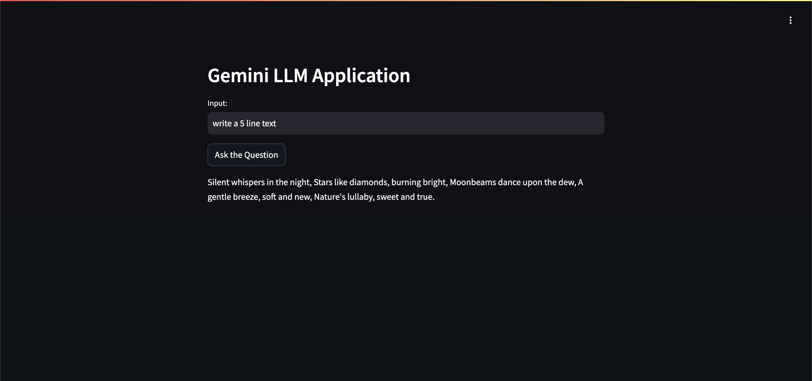

# Gemini Text Generator

A simple Q&A Streamlit app: type a question, Google Gemini answers it.



## Run

```sh
pip install -r requirements.txt
echo 'GOOGLE_API_KEY="your-key"' > .env
streamlit run app.py
```
